# Clinical Data ETL Pipeline

## 🎯 Overview

This project implements a **comprehensive clinical data ETL (Extract, Transform, Load) pipeline** with real-time processing capabilities, quality validation, and RESTful API services. The solution processes clinical measurement data from CSV files and provides robust data management for research studies.

## 🏗️ System Architecture

The pipeline consists of three core microservices:

| Service | Technology | Purpose | Port |
|---------|------------|---------|------|
| **API** | Node.js + TypeScript | Trigger & track ETL jobs; query data | `3000` |
| **ETL** | Python + FastAPI | Parse → validate → load to PostgreSQL | `8000` |
| **Database** | PostgreSQL | Storage + analytics schema | `5432` |

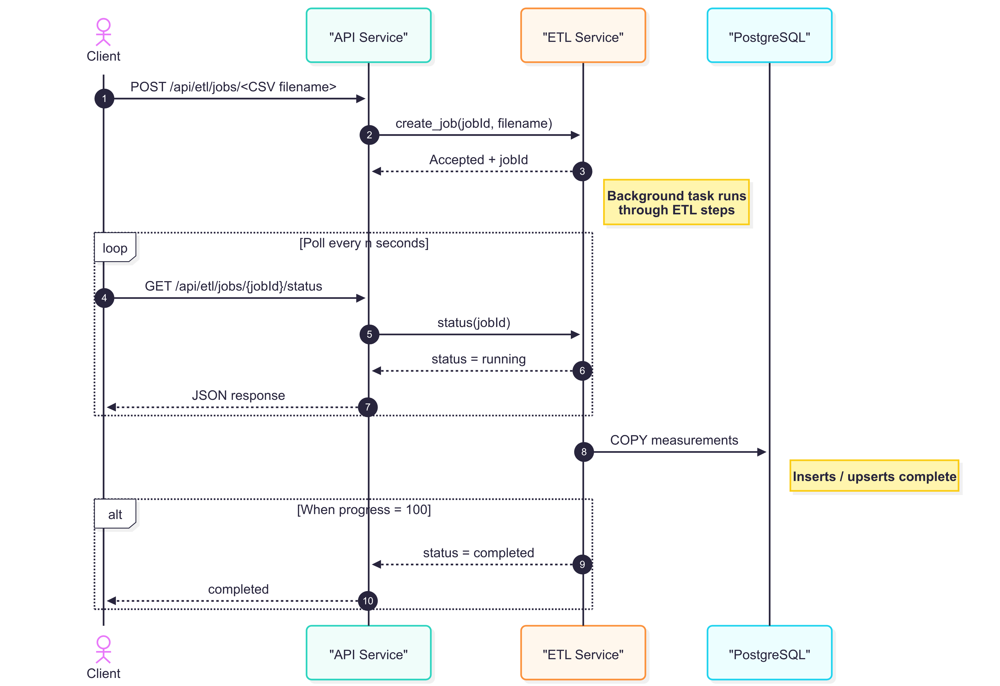

## 🚀 Quick Start

### Prerequisites
- Docker and Docker Compose
- Git

### Installation & Setup

```bash
# Clone the repository
git clone <repository-url>
cd clinical-data-etl-pipeline

# Start all services
docker compose up --build

# Verify services are running
curl http://localhost:3000/health
curl http://localhost:8000/health
```

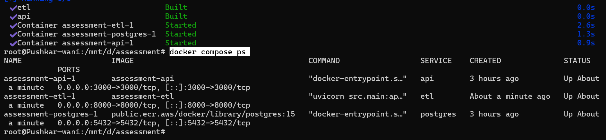

### Service Health Checks

**API Service:**
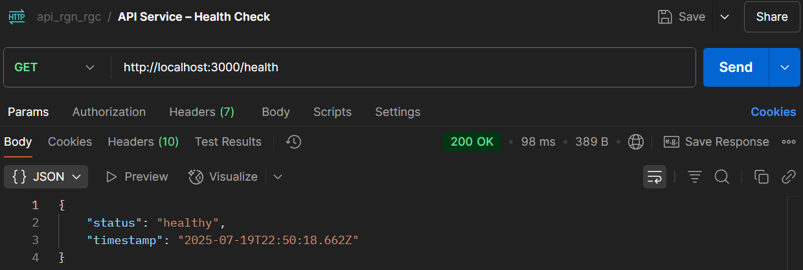

**ETL Service:**
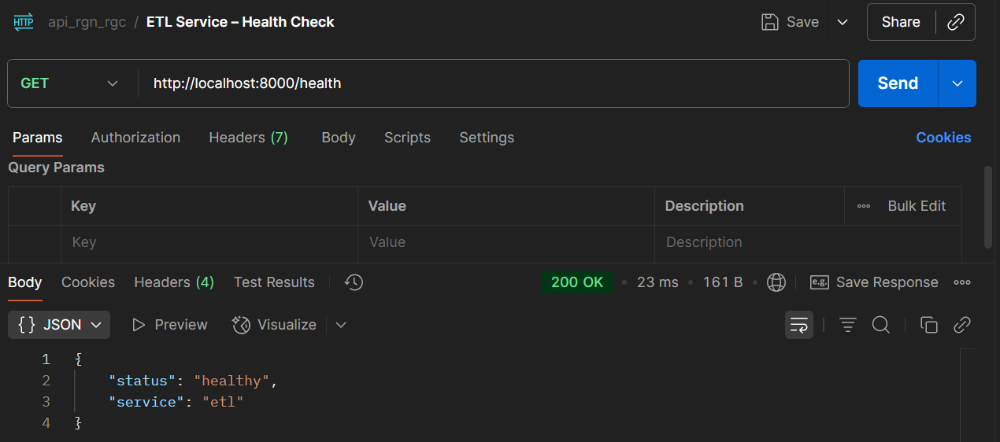

## 📋 API Documentation

### Core Endpoints

#### 1. Submit ETL Job
```http
POST /api/etl/jobs
Content-Type: application/json

{"filename": "sample_study001.csv", "studyId": "STUDY001"}

```

#### 2. Check Job Status
```http
GET /api/etl/jobs/{id}/status
```

Returns: `pending`, `running`, `completed`, or `failed`

#### 3. Query Clinical Data
```http
GET /api/data?studyId=STUDY001&measurementType=glucose
```

Optional filters:
- `studyId` - Filter by study ID (e.g., "STUDY001")
- `measurementType` - Filter by measurement type (e.g., "weight", "glucose")
- `participantId` - Filter by specific participant (e.g., "P003")
- `siteId` - Filter by research site (e.g., "SITE_A")
- `dateRange` - Filter by timestamp range
- `unit` - Filter by measurement unit (e.g., "kg", "mg/dl")
- `qualityScore` - Filter by minimum quality threshold (e.g., "0.95")

## 🔄 ETL Pipeline Features

### Task 1: Job Status Tracking
The system provides real-time job status monitoring with comprehensive logging.

**Create Job:**
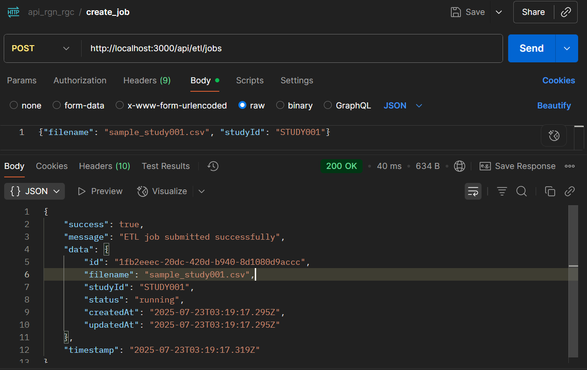

**Job Status - Running:**
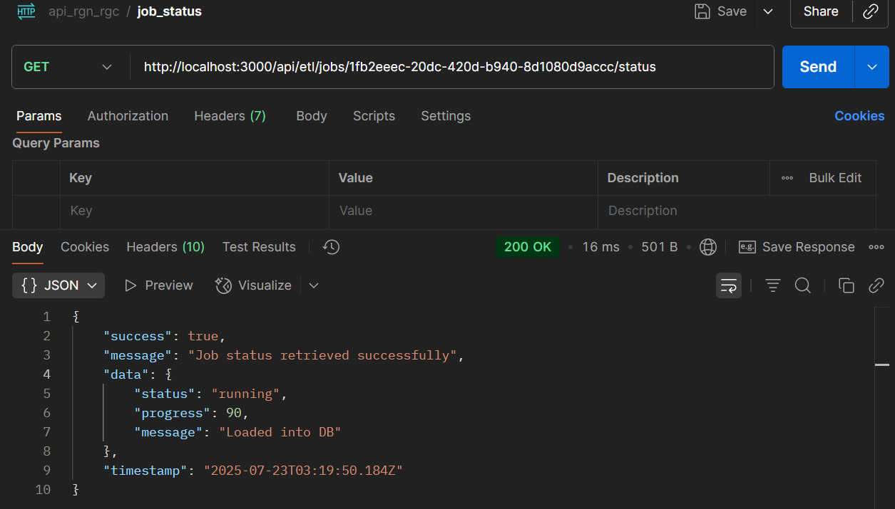

**Job Status - Completed:**
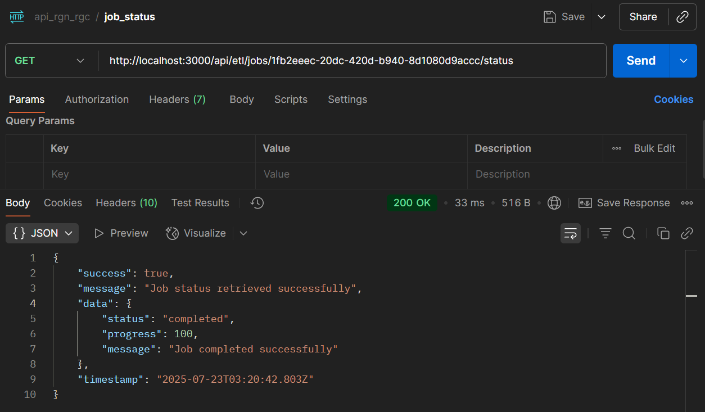

**Query Clinical Data:http://localhost:3000/api/data?studyId=STUDY001&measurementType=glucose**
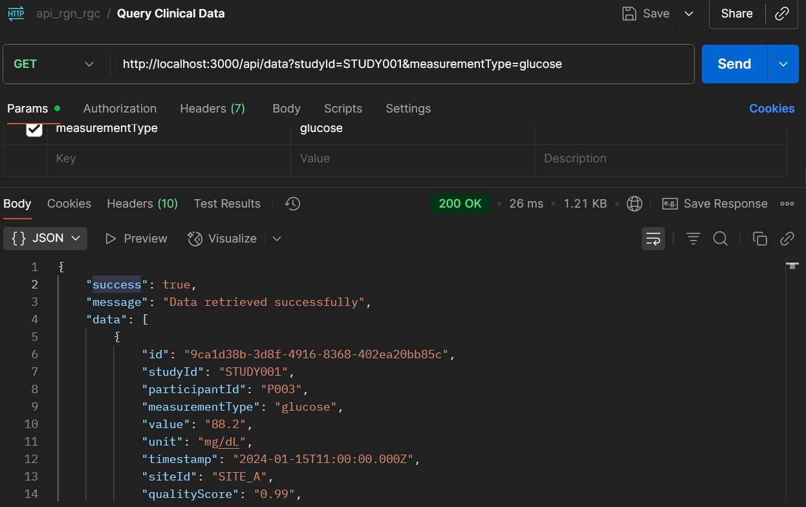
```
{
    "success": true,
    "message": "Data retrieved successfully",
    "data": [
        {
            "id": "9ca1d38b-3d8f-4916-8368-402ea20bb85c",
            "studyId": "STUDY001",
            "participantId": "P003",
            "measurementType": "glucose",
            "value": "88.2",
            "unit": "mg/dL",
            "timestamp": "2024-01-15T11:00:00.000Z",
            "siteId": "SITE_A",
            "qualityScore": "0.99",
            "processedAt": "2025-07-23T03:19:27.442Z"
        },
        {
            "id": "a7bafe00-7016-aa63-a48e-a8bcb1c79d6f",
            "studyId": "STUDY001",
            "participantId": "P002",
            "measurementType": "glucose",
            "value": "102.1",
            "unit": "mg/dL",
            "timestamp": "2024-01-15T10:15:00.000Z",
            "siteId": "SITE_A",
            "qualityScore": "0.97",
            "processedAt": "2025-07-23T03:19:27.442Z"
        },
        {
            "id": "b5040dff-6f05-38d5-08ee-83a83cc26a9d",
            "studyId": "STUDY001",
            "participantId": "P001",
            "measurementType": "glucose",
            "value": "95.5",
            "unit": "mg/dL",
            "timestamp": "2024-01-15T09:30:00.000Z",
            "siteId": "SITE_A",
            "qualityScore": "0.98",
            "processedAt": "2025-07-23T03:19:27.442Z"
        }
    ],
    "timestamp": "2025-07-23T04:14:12.029Z"
}
```

### Task 2: Data Processing Pipeline
Robust ETL processing with validation, transformation, and bulk loading capabilities.

**ETL Success Logs:**
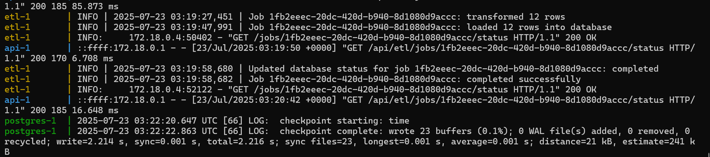

### Task 3: Analytics Schema
Optimized database schema designed for clinical data analytics and reporting.

**Database Schema:**


**Measurement Aggregation:**
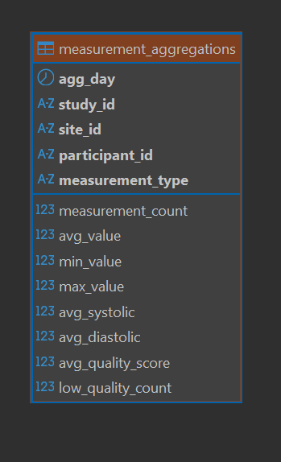

## 📊 Business Intelligence & Analytics

The system answers critical business questions through optimized queries and analytics:

### Q1: Which studies have the highest data quality scores?
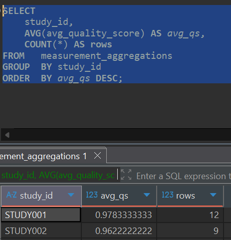

### Q2: What are the glucose trends for a specific participant over time?


### Q3: How do measurement counts compare across different research sites?
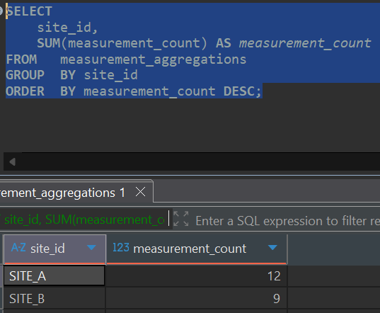

### Q4: Which measurements have quality scores below our threshold?
*Quality threshold: Any quality_score < 0.95 flagged as low quality*
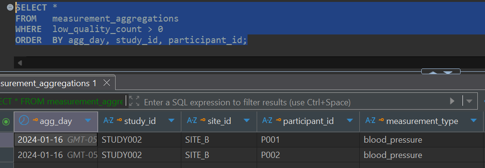

### Q5: What clinical data was collected in the last 30 days?
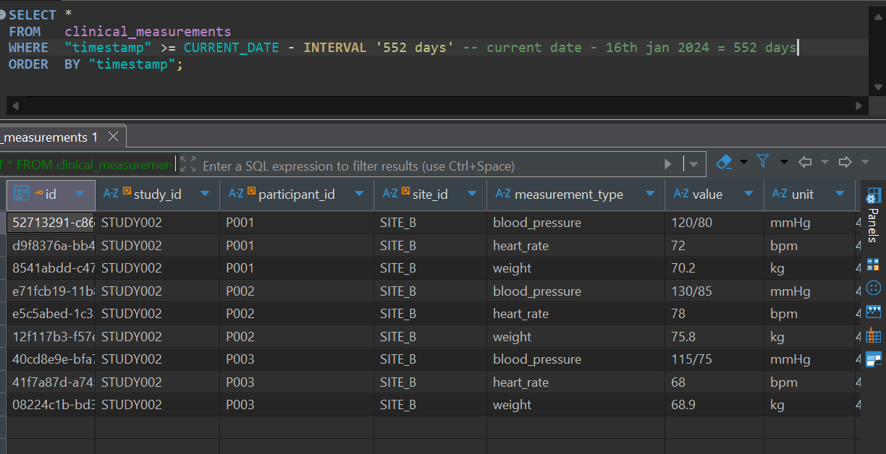

### Q6: How many participants are enrolled in each study?
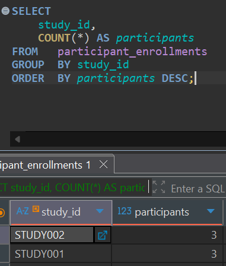

### Q7: What's the average BMI for participants in a specific study?
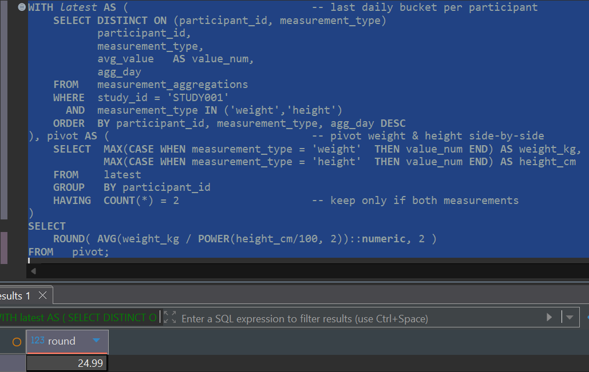

## 🛠️ Technical Features

### Data Quality & Validation
- **Schema validation** for incoming CSV files
- **Data type enforcement** and range checking
- **Quality scoring** algorithm for measurement reliability
- **Error handling** with detailed logging

### Performance Optimizations
- **Bulk loading** for large datasets
- **Database indexing** for analytics queries
- **Connection pooling** for database efficiency
- **Asynchronous processing** for ETL jobs

### Monitoring & Observability
- **Health check endpoints** for all services
- **Structured logging** throughout the pipeline
- **Job status tracking** with detailed progress
- **Error reporting** and alerting capabilities


## 📁 Project Structure

```
clinical-data-etl-pipeline/
├── .vscode/                # VS Code configuration
├── api-service/            # Node.js API service
│   ├── dist/               # Compiled TypeScript output
│   ├── node_modules/       # Dependencies
│   ├── src/                # Source code
│   ├── Dockerfile
│   ├── package-lock.json
│   ├── package.json
│   └── tsconfig.json
├── data/                   # Sample data files
├── database/               # Database configuration
│   ├── queries/            # SQL query files
│   └── schema.sql          # Database schema
├── etl-service/            # Python ETL service
│   ├── src/                # Source code
│   │   └── main.py         # Main ETL application
│   ├── Dockerfile
│   └── requirements.txt    # Python dependencies
├── images/                 # Documentation screenshots
├── node_modules/           # Root dependencies
├── .env                    # Environment variables
├── .gitignore              # Git ignore rules
├── commands.txt            # Useful commands reference
├── docker-compose.yml      # Docker services configuration
├── package-lock.json       # Root package lock
├── package.json            # Root package configuration
├── README_ASSESSMENT_REPORT.md  # Original assessment report
├── README_technical.md     # Technical documentation
└── README.md               # Main project documentation
```

## 🤝 Development Tools

**AI Assistance:** ChatGPT (design brainstorming) & GitHub Copilot (boilerplate generation). All core business logic, SQL queries, and test implementations written manually.


## 🆘 Support

For questions or issues, please open a GitHub issue.